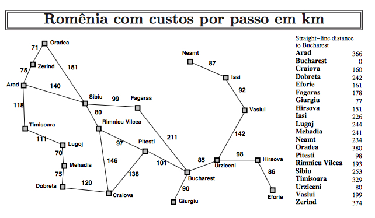

# Resoução do problema Mapa da Romênia com algoritimo A*

## Funcionamento do Algoritimo
O algoritmo A* é um algoritmo de busca heurística que combina o algoritmo de Dijkstra e a heurística de busca gulosa. Ele utiliza uma função de heurística para estimar o custo de se mover de um nó para outro. A partir daí, seleciona o nó com o menor custo total até o momento (caminho percorrido + estimativa do custo restante) para ser explorado em seguida.

## Explicação do problema
O problema do mapa da Romênia é um problema clássico de busca em IA que envolve encontrar o caminho mais curto entre duas cidades na Romênia. O mapa é representado por um grafo onde as cidades são os nós e as estradas são as arestas que os conectam. O objetivo é encontrar a rota mais curta entre duas cidades usando o algoritmo A* (A-star). O problema é desafiador porque as cidades estão em diferentes altitudes e algumas rotas são mais difíceis de percorrer do que outras, o que significa que a heurística para calcular a distância deve levar em conta a altitude das cidades e o terreno ao redor.
<br></br>


## Como executar o programa
<br></br>

### Linguagem Utilizada

`Python 3.10.11` (versão do python usada no desenvolvimento do código)

### Como clonar o repositório

```bash
git clone https://github.com/Rosialdo/Faculdade_6Semestre.git    

```

### Rodar o arquivo
```
python3 map.py

```
